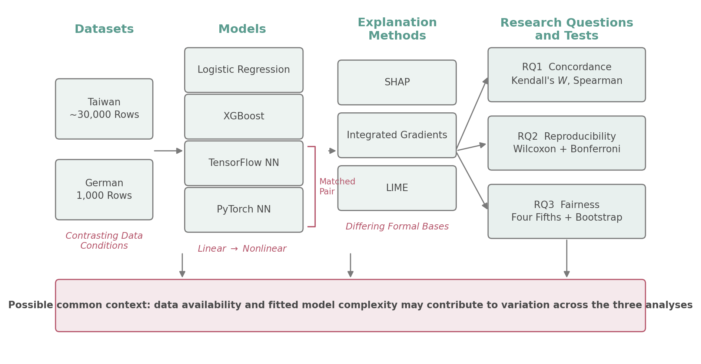
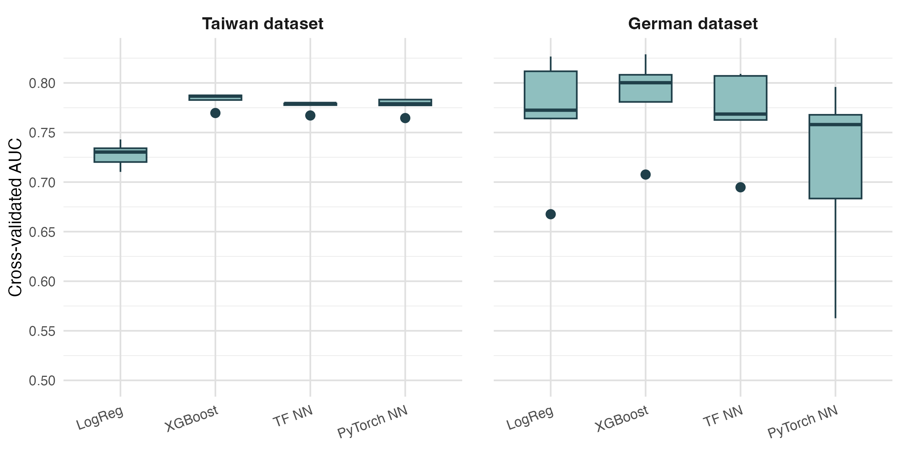
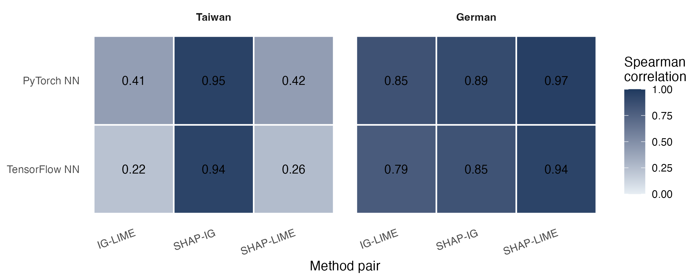
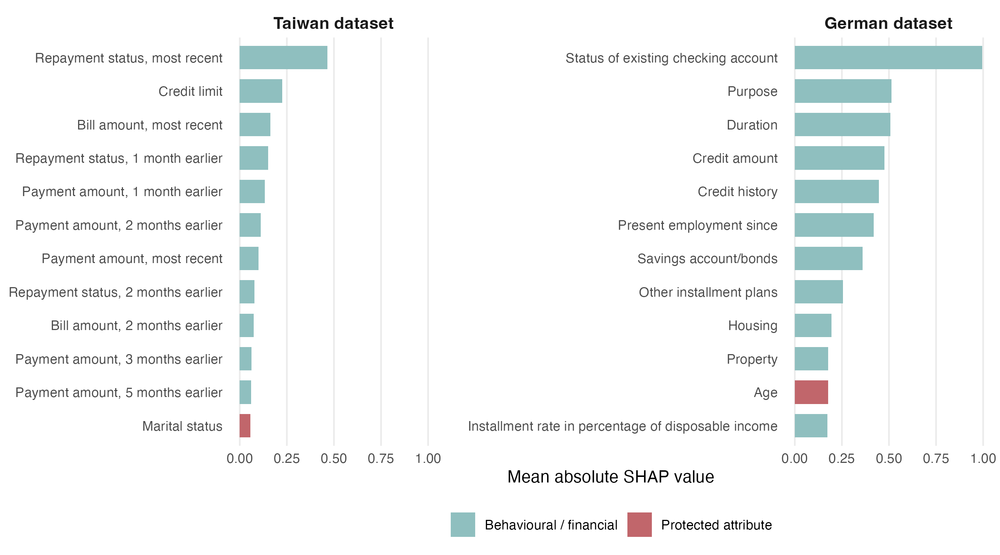
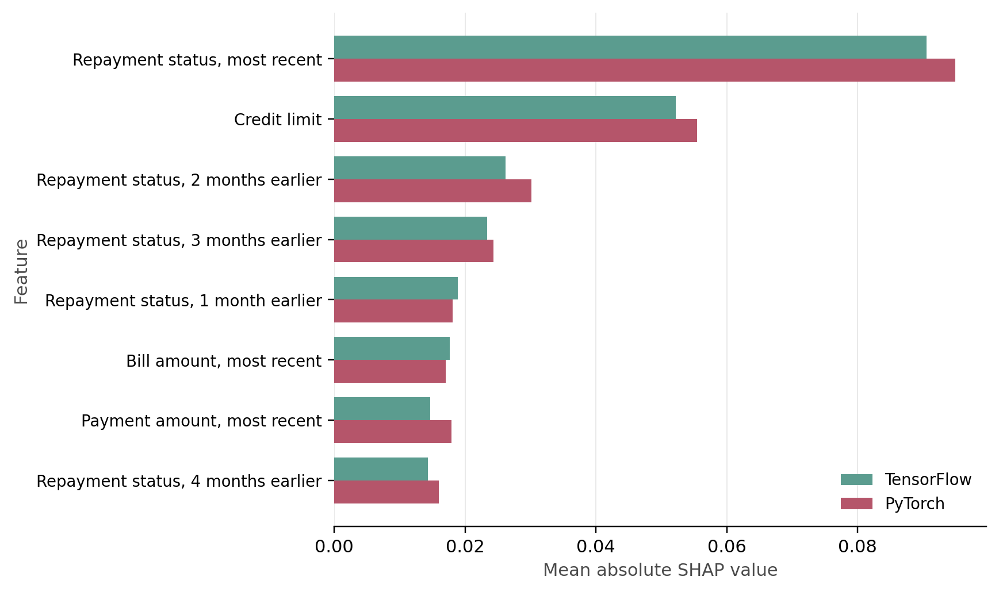
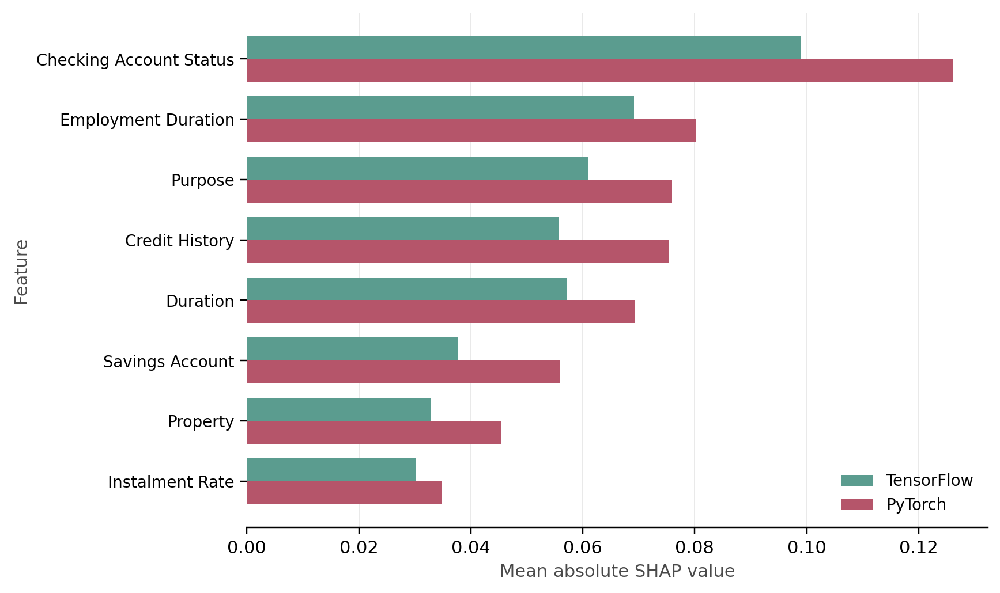
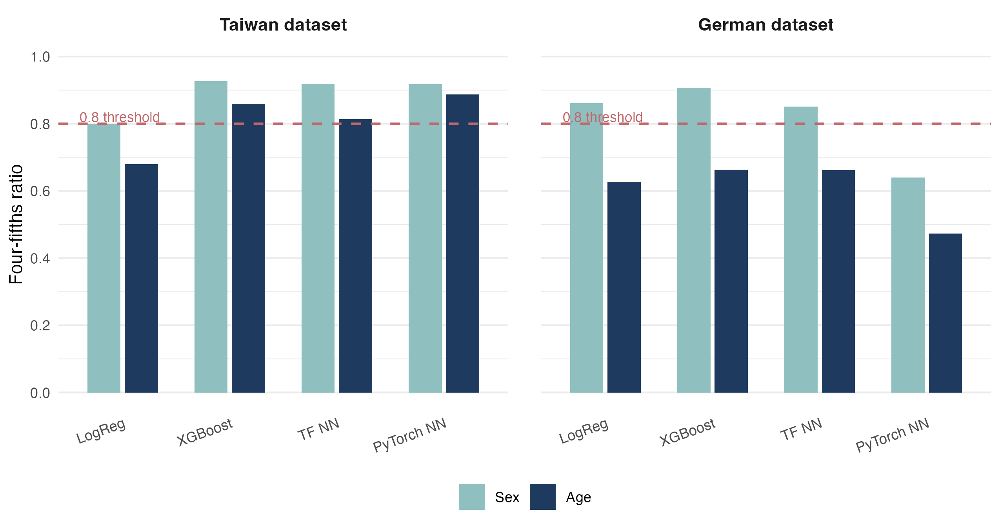
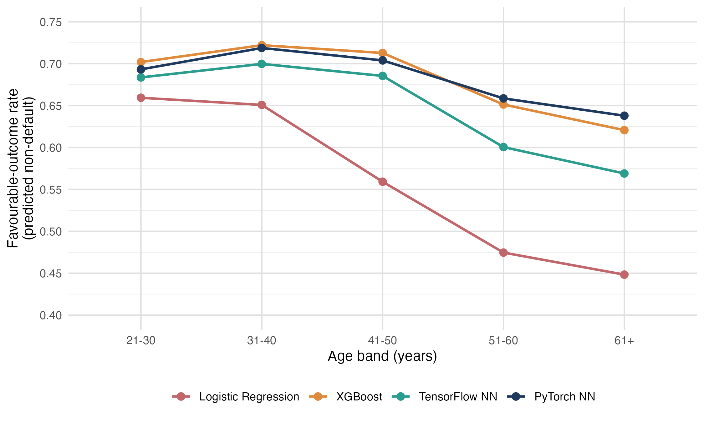

# Explainable AI for Credit Risk Assessment

MSc Data Science dissertation project investigating the **reliability, reproducibility and fairness of Explainable AI (XAI) methods in credit risk assessment**.

The project compares multiple machine learning models and explanation techniques across two established credit risk datasets, with particular attention to whether explanations remain consistent across models, software frameworks and repeated training runs.

---

## Project Overview

Machine learning models are increasingly used in high-stakes applications such as credit risk assessment. While complex predictive models can provide strong performance, understanding **why a model produces a particular prediction** is also important.

This project investigates whether commonly used Explainable AI methods provide explanations that are:

* consistent across explanation techniques;
* reproducible across machine learning frameworks and random seeds; and
* meaningful when considered alongside demographic fairness measures.

The analysis was conducted using the **Taiwan Default of Credit Card Clients** dataset and the **German Statlog Credit** dataset.

---

## Research Questions

The project focuses on three areas:

### RQ1 – Agreement

To what extent do different Explainable AI methods agree when identifying the most important features used by credit risk models?

### RQ2 – Reproducibility

How reproducible are neural network feature attributions when equivalent models are implemented using TensorFlow and PyTorch and trained across multiple random seeds?

### RQ3 – Fairness

How do model predictions and feature attribution patterns relate to demographic fairness measures?

---

## Datasets

### Taiwan Default of Credit Card Clients

The Taiwan dataset contains approximately **30,000 observations** describing demographic characteristics, credit limits, repayment status, bill amounts and previous payment behaviour.

The prediction target identifies whether a customer defaults on their credit payment.

### German Statlog Credit

The German Statlog Credit dataset contains **1,000 observations** describing the financial and demographic characteristics of credit applicants.

The target represents credit risk classification.

The datasets are accessed from the UCI Machine Learning Repository within the analysis notebooks.

---

## Machine Learning Models

Four predictive model implementations were evaluated:

* **Logistic Regression**
* **XGBoost**
* **TensorFlow Feed-Forward Neural Network**
* **PyTorch Feed-Forward Neural Network**

The TensorFlow and PyTorch neural networks use matched architectures to support comparison between machine learning frameworks.

---

## Explainable AI Methods

Three explanation techniques were investigated:

### SHAP

SHapley Additive exPlanations were used to estimate feature contributions and generate global feature importance rankings.

### LIME

Local Interpretable Model-Agnostic Explanations were used to generate local feature weights, which were aggregated to support comparison with the other explanation methods.

### Integrated Gradients

Integrated Gradients was applied to the TensorFlow and PyTorch neural networks to calculate gradient-based feature attributions.

---

## Methodology

The overall workflow consisted of:

**Data preparation → Model training → Predictive evaluation → Explainability analysis → Agreement testing → Reproducibility analysis → Fairness analysis**

Key elements of the methodology included:

* preprocessing and encoding of credit risk variables;
* class weighting to account for class imbalance;
* five-fold cross-validation;
* ROC-AUC evaluation;
* matched TensorFlow and PyTorch neural network architectures;
* SHAP, LIME and Integrated Gradients feature attribution;
* repeated neural network training across 10 random seeds;
* Kendall's coefficient of concordance;
* Spearman rank correlation;
* paired Wilcoxon signed-rank testing;
* Bonferroni correction for multiple comparisons;
* disparate impact analysis using the four-fifths rule; and
* bootstrap confidence intervals.

Categorical feature attributions were aggregated back to their original parent variables before ranking so that explanation methods could be compared using a common feature representation.

### Experimental Design

The experimental design links the three research questions to the predictive modelling, explainability, reproducibility and fairness analyses.



---

## Results and Visualisations

### Model Performance

Predictive performance was assessed using five-fold cross-validated ROC-AUC across the four model implementations.



---

### RQ1 – Agreement Between Explainability Methods

Agreement between explanation methods was assessed using feature importance rankings and rank-based statistical measures.



The analysis also examined the features identified as most important across the different modelling and explanation approaches.



---

### RQ2 – TensorFlow and PyTorch Reproducibility

Matched neural networks were implemented in TensorFlow and PyTorch and repeatedly trained across multiple random seeds.

The comparison investigated whether using different deep learning frameworks affected the resulting feature attribution patterns.

#### Taiwan Dataset



#### German Dataset



---

### RQ3 – Fairness Analysis

Demographic fairness was investigated using disparate impact ratios and the four-fifths rule, with bootstrap confidence intervals used to quantify uncertainty.



Age-related attribution patterns were also examined as part of the fairness analysis.



---

## Key Findings

The analysis demonstrated that the reliability of an explanation depends on the combination of **dataset, predictive model and XAI method**.

Key findings included:

* agreement between explanation methods ranged from moderate to strong across the experiments;
* different XAI techniques did not always produce identical feature importance rankings;
* matched TensorFlow and PyTorch neural networks generally produced similar attribution patterns;
* small differences between neural network explanations were observed across frameworks and repeated training runs;
* the reproducibility analysis demonstrated the importance of assessing XAI methods across multiple seeds rather than relying on a single model execution; and
* fairness analysis provided an additional perspective for assessing model behaviour across demographic groups.

Overall, the project demonstrates that Explainable AI outputs should themselves be evaluated for **agreement, reproducibility and stability**, rather than automatically being treated as definitive explanations of model behaviour.

---

## Repository Structure

```text
explainable-ai-credit-risk/
│
├── README.md
├── .gitignore
│
├── notebooks/
│   ├── Dissertation_Taiwan.ipynb
│   ├── Dissertation_German.ipynb
│   └── Experimental_Design_Figure.ipynb
│
├── r/
│   └── Statistical_Analysis_and_Figures.Rmd
│
├── data/
│   ├── taiwan_cv_auc.csv
│   ├── taiwan_xai_importance.csv
│   ├── taiwan_rq2_shap.csv
│   ├── taiwan_rq2_training.csv
│   ├── taiwan_test_predictions.csv
│   ├── german_cv_auc.csv
│   ├── german_xai_importance.csv
│   ├── german_rq2_shap.csv
│   ├── german_rq2_training.csv
│   └── german_test_predictions.csv
│
└── figures/
    ├── fig_age_gradient.png
    ├── fig_concordance_heatmap.png
    ├── fig_cv_auc.png
    ├── fig_experimental_design.png
    ├── fig_fairness_ratios.png
    ├── fig_framework_german.png
    ├── fig_framework_taiwan.png
    └── fig_top_features.png
```

---

## Repository Contents

### `notebooks/`

Contains the Python notebooks used for the main machine learning experiments.

**`Dissertation_Taiwan.ipynb`**

Contains the Taiwan credit risk analysis, including:

* preprocessing;
* model training;
* predictive evaluation;
* SHAP;
* LIME;
* Integrated Gradients;
* explanation agreement analysis;
* reproducibility experiments; and
* fairness analysis.

**`Dissertation_German.ipynb`**

Contains the equivalent analysis for the German Statlog Credit dataset.

**`Experimental_Design_Figure.ipynb`**

Contains code used to generate the experimental design visualisation.

### `r/`

**`Statistical_Analysis_and_Figures.Rmd`**

Contains the statistical analysis and visualisation performed in R using the outputs generated by the Python notebooks.

### `data/`

Contains generated experimental outputs used for subsequent statistical analysis and visualisation.

These include:

* cross-validation AUC results;
* XAI feature importance results;
* multi-seed SHAP attribution results;
* neural network training diagnostics; and
* test-set predictions used for fairness analysis.

### `figures/`

Contains the main visualisations generated from the modelling, explainability, reproducibility and fairness analyses.

---

## Technologies

### Programming Languages

* Python
* R

### Machine Learning

* Scikit-learn
* XGBoost
* TensorFlow
* PyTorch

### Explainable AI

* SHAP
* LIME
* Captum
* Integrated Gradients

### Data Analysis

* Pandas
* NumPy
* SciPy
* R

### Statistical Analysis

* Kendall's W
* Spearman rank correlation
* Wilcoxon signed-rank testing
* Bonferroni correction
* Bootstrap confidence intervals
* Disparate impact analysis

---

## Skills Demonstrated

This project demonstrates experience in:

* end-to-end machine learning workflows;
* binary classification;
* data preprocessing;
* model evaluation;
* neural network development;
* TensorFlow and PyTorch;
* Explainable AI;
* model interpretability;
* reproducibility testing;
* statistical hypothesis testing;
* algorithmic fairness;
* experimental design;
* Python and R integration; and
* communicating technical results.

---

## Academic Context

This repository contains work completed as part of my **MSc Data Science dissertation** titled:

**Explainable AI for Credit Risk Assessment**

The repository has been included as part of my data science portfolio to demonstrate the technical implementation, experimental methodology and analytical skills developed during the project.

---

## Author

**Gabriella Davis**

MSc Data Science

GitHub: `gabriella-davis0505`
